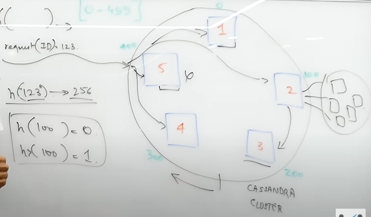

# System Design - I

Created by: TensoR
Created time: December 28, 2024 3:05 PM

# Basics

## Scalability

The ability to 

- Buy bigger machines - Vertical Scaling
- Buy more machines - Horizontal Scaling

to handle more requests is called scalability.

## How much data does YouTube store daily?

1 Billion users

The number of users who upload videos is 1 in thousands.

Around 10 minutes of video and 0.4 Gb per video.

The above calculation makes it to 30 TB of data.

There is only one copy, assuming three copies of storage and 90 TB of data. And for all the resolutions, let’s say it doubled to 180 TB.

### Kind of meta data you want to cache

- Image (thumbnail) - 1/100 MB, i.e., 10 kB.
    - Number of popular videos, and evergreen videos. 10 kB*90*1Million = 1TB.
- The title of the video

## What happens when you enter Google.com?

### TCP

TCP is usually used to deliver static websites such as Wikipedia or Google and also email services and to download files to your computer because TCP makes sure that all the content that is needed gets delivered. It accomplished this by sending the file in small packets of data and, along with each packet, a confirmation to know that the packet was delivered; this makes it slower as the confirmation is needed by the server and the user.

### UDP

UPD is usually used to serve live videos or online games. This is because it is faster and does not check if the information was received or not.

### What Actually Happens….

- So the first thing that happens is that your browser looks up in its cache to see if that website was visited before and the IP address is known.
- If it can't find the IP address for the URL requested then it asks your operating system to locate the website. The first place your operating system is going to check for the address of the URL you specified is in the host file. If the URL is not found inside this file, then the OS will make a DNS request to find the IP Address of the web page.
- The first step is to ask the Resolver (or Internet Service Provider) server to look up its cache to see if it knows the IP Address, if the Resolver does not know then it asks the root server to ask the .COM TLD (Top Level Domain) server - if your URL ends in .net then the TLD server would be .NET and so on - the TLD server will again check in its cache to see if the requested IP Address is there.
- If not, then it will have at least one of the authoritative name servers associated with that URL, and after going to the Name Server, it will return the IP Address associated with your URL.
- After the OS has the IP Address and gives it to the browser, it then makes a GET (a type of HTTP Method) to said IP Address. When the request is made the browser again makes the request to the OS which then, in turn, packs the request in the TCP traffic protocol we discussed earlier, and it is sent to the IP Address.
- On its way, it is checked by both the OS' and the server's firewall to make sure that there are no security violations. And upon receiving the request the server (usually a load balancer that directs traffic to all available servers for that website) sends a response with the IP Address of the chosen server along with the SSL (Secure Sockets Layer) certificate to initiate a secure session (HTTPS).
- Finally, the chosen server then sends the HTML, CSS, and Javascript files (If any) back to the OS who in turn gives it to the browser to interpret it. And then you get your website as you know it.

> Query in Binary Tree works on O(log N).
> 

## Hashing

Pre storing and fetching.

```cpp
// pre storing
int hash[13] = {0}
for(int i=0; i<n; i++){
	hash[arr[i]] += 1
}
```

The search is NoSQL databases are performed by hash functions (chosen so that all nodes have same load).

## Cassandra

There are multiple nodes in a circular form and more than one nodes stores the same data (adjacent nodes). This gives us two features:

- Load Distribution
- Redundancy



### Quorum

The data are stored in more than one node (called as replication factor), so if one node crashed then the remaining nodes can handle the data. The quorum factor is the minimum numerical integral value of number of nodes that should agree on same data.

### Compaction

A feature provided by Cassandra. Its order O(n) operation, its provide merge sort algorithm, so basically merge duplicates records into one. It set a Tomb Stone flag kind of thing to a record representing it as killed or not in use.

# Load Balancing

## What is Load Balancing?

Lets say you have N servers, you need to balance load to all the server evenly, this process is called load balancing.

This can be done by Consistency Hashing, which randomly generated a number from 0 to M-1 taking request id as input. The value we get from hashing function will direct to that server. In reality, the hash function does not generate random mapping, it is somehow relates the user info into the data. This means that the hash function always redirect to the same server again and again, which means we can have cache for a particular server.

Now, the moment we add a new server the cost of distributing data increases, and a problem arise here is to add server such that the cost of distributing data is low somehow. Here, comes something called Consistent Hashing.

## Consistent Hashing

 In consistent hashing we still do mapping with request. Instead of array, there’s a circular mapping, i.e., ring of maps. (0 to M-1)

The hashing is done one server ID as well and then the remainder is applied with number of request mapping. See below


Then we go clockwise and find nearest server for a request. Since, the distance is small the load is small. The load factor comes to average, i.e., $1/N$.

When one server goes down the next server will get a lot of load. This can be solved by using more than one hash function (k hash function), this maps more than one server to a particular server point.

## Sharding

[Untitled](Untitled%2016b43822c388809cb445f4b080b3eb02.csv)

The servers here are database servers, not an application server. Also, the partitioning of overall database is done on the basis of some primary key, this type of processing is called horizontal partitioning.

Sharding is taking one attributes of data and partitioning such that each server get one chuck of the dataset.

- Consistency
- Availability

Each color in the chart represents one shard above, which manages their own data.

Now there is something called cross shards, where the data need to be pull from two adjacent shards and then joining happens.

1. There is problem with joining as it is needed.
2. Fixed number of shards.

For solving above issues, the slicing is done very very small and a manager manages the data to let it together and pass to the server.

# DataStores

## Bloom Filters

Lets say there are three different hash map is used. And after passing a string with all three the number generated with them combined are unique for each string. This data structure is also called as bloom filters.

> Above concept is used by Facebook to avoid *One-tap One-go*, where lets say you searched amoeba once, it still get pushed in browser cache and for that something of regular searched kicked out of cache. Facebook save cache only if you are searching it multiple times. (Pehle ML ni hota tha 🙂)
> 

Lets say there are three hash map represented by an array of 0 to 8.

- Case 1: We passed “cat” to the bloom filter.
    - The value we get are 3, 7, 2 from each hash map.
    
    
    
- Case 2: We passed “mat” to the bloom filter.
    - The value we get are 4, 7, 2
    - Check the values for hash function, if all of 4, 7, 2 values are already 1 then we assume that the string is already searched, if there is any single zero then it’s guarantee that the string has been searched.
- Case 3: After many searched, maximum values will already be searched, so it will become in accurate, which can be solved by bloom filters’ `reset()` function.

### Mathematical Formula

lets N be the number of string, M be the length of bloom filter, and k is number of hash function.

Probability of a particular bit has not be set by one string are

$$
(1-1/m)^k
$$

Probability of a particular bit has not been set by $i$ strings are

$$
(1-1/m)^{k.i}
$$

The probability of particular bit has been set by mistake is

$$
[1-(1-1/m)^{k.i}]^k
$$

The graph first decreases and then start increasing, so the optimal value of k can be given as

$$
k_{optimal}=\frac{m}{n}log2
$$

## Master-Slave Architecture


There are two type of updating copy database, that are sync and async.

Slave only copies data, the write operation won’t happens in slave database.

Once case can be make both A and B master, but the problem arises when the communication between them fails. In that cases both A and B will assume that they are master. This problem is called `split problem`. This can be solved by using 3 nodes and 3 servers.


Above concept is happening on the land of `Distributed Consensus`, which states that more than one node should agree on a particular point to proceed through the transactions.

## How are NoSQL databases optimized?

To speed up query, the *B+ Tree* data structures are used. 

- Insertion - O(log(n))
- Search - O(long(n))

To scale up the data we want to reduce unnecessary values which includes:

- Header - bandwidth
- I/O calls  - multiple I/O calls causes time consumption.

Above can be solved by removing header and combining all the data queries into single query. This also as a drawback as the server need additional memory, and slow reads as needed to be search the data.


Instead of linked list we can use the data in Sorted Array which takes read operation as O(log(n)). The sorted array conversion is only done in the database, not in the server so the read and write both are O(log(n)).

### The problem with sorting itself

The problem with sorting operation is that it take time complexity of $O(n.log(n))$, which is again very inefficient for larger dataset.

To solve above issue we distribute the dataset in chunks. Again this increase the searching slow. The solution now is to use some hybrid operations. For searching, these chunks are merged into larger sorted array. The process of combining multiple sorted array into one is called compaction.


Create a bloom filter to find a data if its exist in particular chunk or not.


## Location-based Databases

[https://youtu.be/OcUKFIjhKu0?si=DXyY2fuFglpqIPk-](https://youtu.be/OcUKFIjhKu0?si=DXyY2fuFglpqIPk-)

The problem with the pincode is that despite of having adjacent locality the delivery man might need to travel much larger distance because of river, or unconnected roads. The requirements then arises are:

1. Measurable Distance
    1. Uniform assignment
    2. Scalable granularity
2. Proximity

The first problem can be solved by calculating Euclidian distance using coordinates. The problem arises with the proximity as if you need to find which are the ten closest location, you need to iterate over all the database.

### Using manipulated bits

The coordinates of the area can be represented in 64-bits, 32-bits, 2-bits and many more according to proximity need. The lesser the bits used to store coordinates, the larger the inaccuracy and hence, the larger the proximity. Lets say for we are using smaller bit then 5.4634 and 5.4638 both are represented in 5.46.


The representation happens like, for every bit of 0 or 1 in x-axis, 0 means go right by one unit while 1 means go left by one unit. Similarly, for y-axis as well.

In terms of proximity if the first n-1 values are same that means they lie between each other.


A representation of world using quad-tree.

The searching is slow in above quad-tree in the case of skewed distribution. But its fast for 1D tree, which is always $O(log(n))$. So, the idea arises is to convert the 2D tree to 1D tree.

### Fractals

They have fractional dimensions, 2.3D, i.e., you are not in 2D, neither in 3D.

We use similar concept in our case as well.


We are using Hilbert curve as there are no longer like unlike Z or $\alpha$ curve which is better in proximity information. Since, its recursive, we can always zoom in.


The problem arises here is that it won’t form continuous line and hence harder to search.


## Data Migration

Data Migration means moving digital data. It is the process of transferring data to a different location, file type, media, storage system, database or application.

### Important Steps in the Data Migration Process

- Objective and requirements gathering
- Access the source and target data
- Potential risks and obstacles
- Determine the required human, financial, and technical resources
- Choosing the appropriate tools and technologies
- Do proper testing to ensure the accuracy and consistency of the migrated data
- Proper documentation of the end-to-end migration process and share knowledge transfer to relevant members.

### Types of Data Migration

1. **Big Bang Data Migration**
    
    It is a single-step process.
    
2. **Incremental Data Migration**
    
    An incremental migration strategy supports gradually transitioning from an old system to a new system or new DB. **Example**: Consider a large e-commerce company that wishes to migrate customers information (such as purchase details, preferences, and finance details) from one DB to another without affecting the customer's business.
    
3. **Hybrid Data Migration**
    
    A hybrid data migration strategy combines two or more migration methods to achieve the specific needs of the organization's data migration.
    
    **Example:** This type of migration is mainly designed for military systems that have sensitive data.
    
4. **Parallel Data Migration**
    
    In the Parallel Data Migration strategy, both old and new systems run simultaneously while data is imported into the new system. When all issues are resolved and the new system is working smoothly, it will replace the old system.
    
    **Example**: Suppose a large financial institution upgrades its banking system to a new DB. During the migration, both the old and the new DB run parallelly.
    

# Consistency vs Availability

## Data Consistency

[https://www.youtube.com/watch?v=m4q7VkgDWrM](https://www.youtube.com/watch?v=m4q7VkgDWrM)

Consistency refers to the state where any user’s data should be same across both servers.

We need data consistency because of following reasons:

- Single Point Server
- Cost Vertical Scaling
- Latency (high)

Above issues can be solved by using multiple server.

Putting few of the important data cached on multiple server.

> Two Generals Problem - You can never be sure that if you are making commit, it actually changes or not.
> 


This solves many issues as only A can write the data as leader and B and C only reads the data.

### Two Phase Commit (2 PC)

As a leader when you get an update, you send a prepare request to your follower (another servers) in response of which they send an acknowledgement. After which you commit them the changes and again get acknowledged by them.

The servers should wait for leader to roll back, only then they can roll back otherwise they have to wait or keep retrying to communicate again and again.

## Data Consistency Level

There are seven types of data consistency level.

### 1. Strong Consistency

Also known as linearizability or strict consistency, this types guarantees that every read operation receives the most recent write operation’s value or an error.

Example: *A traditional SQL database system with a single master node and multiple replicas ensures strong consistency. When a client writes data to the master node, subsequent reads from any replica will immediately reflect the latest value written. All replicas are updated synchronously, ensuring that all clients see a consistent view of the data.*

### 2. Eventual Consistency

Eventual consistency guarantees that the data replicas will eventually converge to the same value even while it permits them to diverge briefly.

Example: *Amazon's DynamoDB, a distributed NoSQL database, provides eventual consistency.*

### 3. Causal Consistency

Causal consistency preserves the causality between related events in a distributed system. If event A causally precedes event B, all nodes in the system will agree on this ordering.

Examples: *A collaborative document editing application, where users can concurrently make edits to different sections of a document, requires causal consistency. If user A makes an edit that depends on the content written by user B, all users should observe these edits in the correct causal order. This ensures that the document remains coherent and maintains the intended meaning across all users.*

### 4. Weak Consistency

It offers the least amount of assurance. It just ensured that updates will eventually spread to every duplicate, even though it permits significant differences between them. In systems where high availability and low latency are more important than tight consistency, weak consistency is frequently employed.

Example: *A distributed caching system, such as [**Redis**](https://www.geeksforgeeks.org/introduction-to-redis-server/) or Memcached, often implements weak consistency. In such systems, data is stored and retrieved quickly from an in-memory cache, but updates may be asynchronously propagated to other nodes. This can lead to temporary inconsistencies where clients may observe old or divergent values until updates are fully propagated.* 

### 5. Read-your-Writes Consistency

This type of consistency guarantees that after a client writes a value to a data item, it will always be able to read that value or any subsequent value it has written.

Example: *A social media platform ensures read-your-writes consistency for users' posts and comments. After a user publishes a new post or comment, they expect to immediately see their own content when viewing their timeline or profile.*

### 6. Monotonic Consistency

It ensures that if a client observes a particular order of updates (read or writes) to a data item, it will never observe a conflicting order of updates.

Example: *A distributed key-value store maintains monotonic consistency by guaranteeing that once a client observes a particular sequence of updates, it will never observe a conflicting sequence of updates. For instance, if a client reads values A, B, and C in that order, it will never later observe values C, A, and B.*

### 7. Monotonic Reads and Writes

These consistency guarantees ensure that if a client performs a sequence of read or writes, it will observe a monotonically increasing sequence of values or updates.

Example: *Google's Spanner, a globally distributed relational database, ensures monotonic reads and writes consistency. When a client reads or writes data, it observes a monotonically increasing sequence of values or updates. This guarantees that clients always see the most recent data and that writes are applied in the same order across all replicas.*

## Transaction Isolation Levels

Transactions are a collection of queries that perform one unit of work. They are atomic which means either all queries in a transaction are executed or none of it is executed.

### BEGIN

Marks the start of the transaction.

### COMMIT

Marks the end of the transaction, which results in the changes persisting to the database.

### ROLLBACK

Marks the end of the transaction and undoes all the changes to the database.

### ISOLATION

If two transactions are running concurrently and queries in one transaction do not affect the other transaction then the two transactions are said to be isolated from each other.

### READ UNCOMMITTED

At tis isolation level, even uncommitted data can be read by concurrent  transactions. Although it is very fast, it leads to dirty reads.

# Message Queues

## What is Message Queue

[https://youtu.be/oUJbuFMyBDk?si=XldUwx2udmacDbtd](https://youtu.be/oUJbuFMyBDk?si=XldUwx2udmacDbtd)

There is a notifier that keep checking each server at particular interval of time, by sending a message and receiving the response from them.

If any server did not respond, the notifier will inform the main code assuming that the particular server is not working. The main will pick the unperformed operations and redistribute the tasks to remaining servers.

In above case, the problem arises when the server is still processing a task and didn’t respond to notifier, and hence the same task is performed by another server as well.

To solve above issue we need load balancing.

So, now the requirements arises are notifier, load balancing, persistency and hence, introduced Message/Task Queue.

## Publisher-subscriber model

[https://www.youtube.com/watch?v=FMhbR_kQeHw](https://www.youtube.com/watch?v=FMhbR_kQeHw)

There is something called message broker, which make sure that the process by one server is completed before passing to another server. Message broker is kind of temporary server that make things easier and transaction guarantees. Unlike in series of server the last server didn’t respond will cause failure to overall system, but message broker save the messages after each server’s processes.

## Event Driven System

[https://youtu.be/rJHTK2TfZ1I](https://youtu.be/rJHTK2TfZ1I)


These type of architectures are used in git, online gaming, twitter etc.

The advantages of even driven architecture are:

- Availability
- Easy Roll-back
- Replacements
- Transactions Guarantees
- Stores Intent

The disadvantages are:

- Hidden flow
- Hard migration

## Anti Pattern

[https://youtu.be/9T-gNZ5bGCw?si=SdDEr8NCFOI7aYm_](https://youtu.be/9T-gNZ5bGCw?si=SdDEr8NCFOI7aYm_)

Anti-pattern is using the database as message queues. The idea here is that each of the changes are performed in the common database by different servers, and the only way to find out whether the change by another server has been done or not is to read the database.

# DevOps Concepts

## Single Point of Failure

A single point of failure are those points where entire system crashes incase that point crash. This also means the architecture is non resilient. 

- Easiest way is to increase the number of node for that points.
- Make multiple database (Master-slave architecture).
- User multiple load balancer.
- Multiple IP addresses.
- Multiple physical regions.

> Netflix has something called chaos monkey, which randomly goes on a node and take down that node to check whether the system still works or not.
> 

## Containers


The problem above arises is when yellow took all the memory then the system crashes. Which means we need a strong limiter of memory such that a particular program will never cross that limit. This can be done by using VMs instead of interface. Its kind of running OS on top of an OS.

This brings the concept of cloud computing.

- App Isolation
- Platform Independence
- Cost Saving


A container is something that contains information about what system and what memory you need or you ran your program. One of the famous container is docker which asks the OS instead of VMs (as VMs need a lot of time to boot), the docker itself manages the memory and requirements by asking OS.

The major advantage of container are they a bit slow.

## Service Discovery and Heartbeats

Lets say there is a Health Service which check if a particular server is alive or not, same as notifier. Each checking is called heartbeat. The load balancer redistribute the services, if required. If the server respond to health service that its alive on its own, its called two way heartbeat (this solve the issue if the application is dead as server might not respond on its own). 

## Cascading Failures

Cascading refers to a hierarchical arrangement where the output of one system component becomes the input for the next, essentially creating a chain reaction where changes or effects in one part of the system propagate through to subsequent components, impacting the overall system behavior; it often describes a situation where a failure in one part can lead to cascading failure in connected systems.

It might also happens that a server failed due to some issue and hence, all other server fails due to overload.

### Rate Limiting

The rate limiting work on the concept of it’s better to be available for some users instead of zero users.

There is a queue which keep checking the maximum load of a particular server and as soon as the new requests come, the queue reject it sending failed respond to the client.

### Viral/Black Friday

You know the day you are going to overload or something, as the name suggest.

- Pre scale
- Auto scale

### Jobs Scheduling

Divide all users into chunks, for example, on new year first 10000 people will receive wish in first minute, next 10000 in second minute, and so on.

### Popular Post

If a post become very popular suddenly.

YouTube solve it by adding jitter. For example, a lot of data are not necessary to update live for example, likes, subscriber count, views count. They pre approximate these things and didn’t update the live counts.

### Solutions

- Pre-scale
- Auto-scale
- Rate-limiting
- Batch processing
- Approximate statistics
- Caching
- Gradual deployments
- Coupling (store data similar to caching but not caching) - Cache user’s username, password and instead of talking to authentication service, direct bypass that stuff.

## **Anomaly Detection in Distributed Systems**

We need few metrics to figure out the things:

1. Number of processes
2. Request Queue Size
3. Number of requests
4. Error rate

Instead of server figuring out these things, we use machine learning engine to ensure health of the system (well you know better 🙂). Forgive for false positive, not for false negative.

### Isolation Tree

A decision tree is used, in which we are partitioning a data in a certain number of times. Let’s say your age is less than 10 you end up buying a house, well its an anomaly.

## Distributed Rate Limiting

There is something called a timer wheel

- Size of the wheel (Number of buckets) = Timeout of the incoming request
- Each bucket is numbered from 0 to Timeout -1
- Each bucket can store a limited number of requests
- Every time we add a request to the bucket number Time % Number of buckets
- Our system can pull requests from this queue one by one.
- Before inserting a new request into a bucket it deletes all the existing requests (These requests have not been processed by the system).